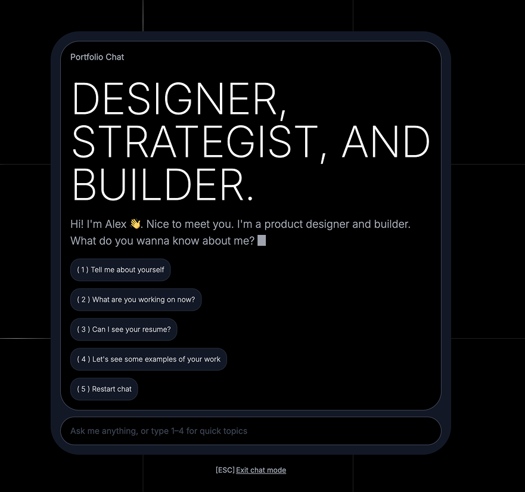
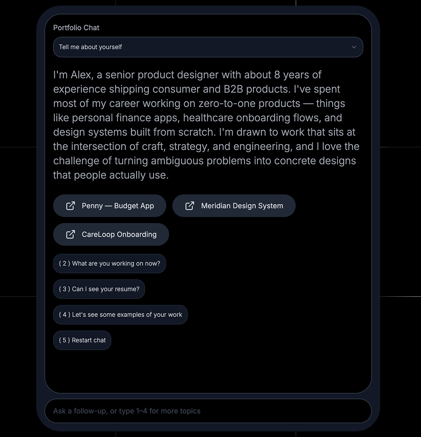

# Portfolio AI Chat

An AI-powered chat page for your design portfolio. Recruiters and hiring managers can ask it anything about your work, experience, and background — and get instant, conversational answers.

Built with Next.js, Tailwind CSS, and the Anthropic API (Claude). Designed to be forked and customised in under 10 minutes.



---

## Demo

> Add a link to your live demo here once deployed.

### Welcome Screen


### Chat in Action


---

## Features

- Conversational AI that answers questions about you in first person
- 4 preset prompts (about you, current work, resume, examples) with keyboard shortcuts (1–4)
- Stacked prompt history tab bar to revisit previous answers
- Streaming responses with typewriter effect
- Action buttons that appear contextually (resume download, LinkedIn, project links)
- Dynamic project button detection — if the AI mentions a project by name, its button auto-surfaces
- In-memory response caching for common first-turn prompts
- Rate limiting (20 messages / hour per IP)
- Configurable AI model via environment variable
- Dark mode only — designed for portfolio aesthetics

---

## Setup in 3 steps

### 1. Clone and install

```bash
git clone https://github.com/YOUR_USERNAME/portfolio-ai-chat.git
cd portfolio-ai-chat
npm install
```

### 2. Add your API key

```bash
cp .env.example .env.local
```

Open `.env.local` and replace `your_anthropic_api_key_here` with your key from [console.anthropic.com](https://console.anthropic.com).

### 3. Fill in your info

Open `content/portfolio-knowledge.ts` — this is the **only file you need to edit**. Replace the placeholder "Alex Rivera" content with your own.

Then run the dev server:

```bash
npm run dev
```

Visit [http://localhost:3000](http://localhost:3000).

---

## Deploy to Vercel (one click)

[](https://vercel.com/new/clone?repository-url=https://github.com/modusops/portfolio-ai-chat&env=ANTHROPIC_API_KEY&envDescription=Your%20Anthropic%20API%20key%20from%20console.anthropic.com&envLink=https://console.anthropic.com)

Vercel will prompt you for your `ANTHROPIC_API_KEY` during deploy. No other config needed.

---

## Customisation guide

### Your content — `content/portfolio-knowledge.ts`

This file is your AI's brain. Everything it knows about you comes from here. The file is heavily commented — read the comments in each section.

Key sections:

| Section | What it controls |
|---|---|
| `meta` | Welcome screen headline, greeting message, your name |
| `about` | All the "tell me about yourself" content |
| `projects` | Case study details the AI can discuss |
| `resume` | Career history and education |
| `workingStyle` | Culture-fit / personality questions |
| `faq` | Pre-written answers to common recruiter questions |
| `actions` | Buttons (resume PDF, LinkedIn, project links) |

### Your resume — `/public`

Put your resume PDF in the `/public` folder and update `actions.resume.url` in the knowledge file to match (e.g. `/your-name-resume.pdf`).

### AI model — `.env.local`

The default model is `claude-haiku-3-5-20251001` (fast and cheap, great for portfolio chat). To use a smarter model, add this to `.env.local`:

```
ANTHROPIC_MODEL=claude-sonnet-4-5
```

### Preset prompts

The four preset buttons ("Tell me about yourself", "What are you working on?", etc.) are defined in `app/chat/page.tsx` in the `allSuggestions` array. You can rename them, but keep the same `id` values if you want the action buttons to keep working correctly.

---

## Project structure

```
portfolio-ai-chat/
├── app/
│   ├── layout.tsx              Root layout (Inter font, dark theme)
│   ├── page.tsx                Redirects to /chat
│   ├── globals.css             Global styles
│   ├── chat/
│   │   ├── page.tsx            Chat page (state management)
│   │   └── components/
│   │       ├── WelcomeState.tsx        Welcome screen with typewriter
│   │       ├── ResponseState.tsx       AI response + action buttons
│   │       ├── StackedPromptTabBar.tsx Prompt history UI
│   │       ├── ChatBetaHeader.tsx      "BETA" badge
│   │       ├── ExitChatBanner.tsx      ESC / exit link
│   │       ├── PromptButton.tsx        Tab button
│   │       └── ChatGridBackground.tsx  Animated grid lines
│   ├── api/chat/route.ts       Streaming API route (Anthropic)
│   └── components/
│       ├── TypewriterText.tsx          Static typewriter (welcome screen)
│       └── StreamingTypewriter.tsx     Streaming typewriter (AI response)
├── content/
│   └── portfolio-knowledge.ts  ← EDIT THIS FILE
├── public/
│   ├── bong_001.ogg            UI sound effects
│   ├── select_001.ogg
│   ├── scroll_001.ogg
│   └── glitch_001.ogg
├── lib/utils.ts
├── .env.example
└── README.md
```

---

## Tech stack

- [Next.js 15](https://nextjs.org) — App Router, streaming API routes
- [Tailwind CSS](https://tailwindcss.com) — Utility-first styling
- [Anthropic SDK](https://github.com/anthropic-ai/anthropic-sdk) — Claude AI
- [next-themes](https://github.com/pacocoursey/next-themes) — Theme management

---

## Cost

Using the default Haiku model, a typical recruiter session (4–8 messages) costs roughly **$0.001–$0.003**. Set a monthly budget cap in your [Anthropic dashboard](https://console.anthropic.com) as a safety backstop.

---

## License

MIT — fork it, ship it, make it yours.
